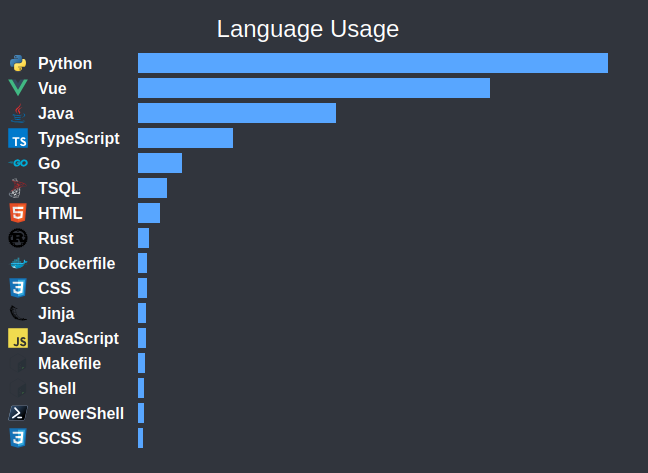

# GitHub Repository Language Usage Analyzer

This Python application fetches and analyzes the programming languages used in a user's GitHub repositories. It retrieves the repository data via GitHub's API, computes the byte count of each language used, and generates a horizontal bar chart to visualize the language distribution.


## Features

- Fetches a list of GitHub repositories for an authenticated user.
- Analyzes the programming languages used in the repositories.
- Filters repositories or languages based on user preferences.
- Generates a horizontal bar chart that visualizes language usage in a user's repositories.

## Requirements

- Python 3.13 or higher
- `requests` library
- `jinja2` library
- `python-dotenv` library

You can install the required dependencies using the following:

```bash
pip install .
```

## Setup

Clone this repository:

```bash
git clone https://github.com/SEary342/github-language-analyzer.git
cd github-language-analyzer
```

Create a .env file in the project root directory and add your GitHub personal access token and any configuration options. Example:

    GH_TOKEN=your_github_token_here
    REPO_FILTER=repo1,repo2
    LANG_FILTER=Python,JavaScript

* GH_TOKEN: Your GitHub personal access token (required for API authentication). Make sure you give it read access to your private repos (if you want them included)
* REPO_FILTER: A comma-separated list of repository names to exclude from analysis (optional).
* LANG_FILTER: A comma-separated list of programming languages to exclude from the chart (optional).

## Usage

To run the application, use the following command:

```bash
python main.py
```

The script will:

- Fetch all the repositories associated with your GitHub account.
- Analyze the languages used across these repositories.
- Generate a bar chart (language_chart.png) showing the language usage by byte count.
- Print the byte count for each language in the terminal.

Customization

- Filter repositories: Use the REPO_FILTER environment variable to exclude specific repositories from analysis.
- Filter languages: Use the LANG_FILTER environment variable to hide specific languages from the chart.
- Chart appearance: You can adjust the chart's appearance by modifying the generate_bar_chart function.

Example

After running the script, you'll see output like:

Python: 123456 bytes
JavaScript: 7890 bytes
...

Chart saved to language_chart.png

A language_chart.png file will be generated in the project directory, displaying the language usage across your repositories.

This can be installed into a github profile readme with the following markdown:

```

```


## License

This project is licensed under the AGPL License - see the [LICENSE](LICENSE) file for details.


Feel free to copy and paste this into your project!
